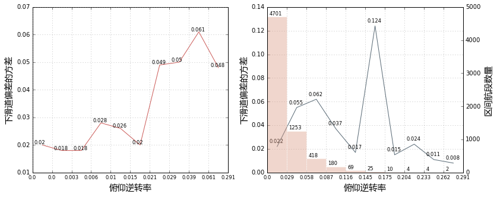
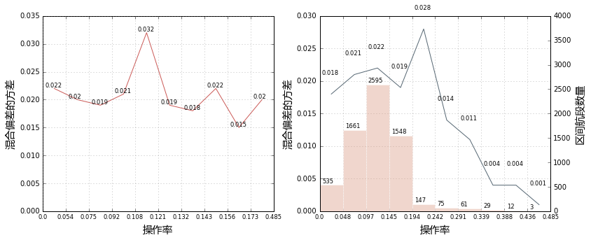

# 关于操作与稳定性的研究

## 2 逆转率与稳定性
### 2.1 俯仰逆转率与下滑道稳定性的关系


```python
myplot(table=table,
           blocks_num=10,
           x_col='PITCH_CROSS_RATE',
           y_col= 'VAR_G',
           round_num=3,
           figsize=(13,5),
           ax1_ylim=(0.01,0.07),
           ax1_xlabel=u'俯仰逆转率',
           ax1_ylabel=u'下滑道偏差的方差',
           ax2_ylim=(0, 0.14),
           ax2_xlabel=u'俯仰逆转率',
           ax2_ylabel=u'下滑道偏差的方差',
           ax21_ylim=(0, 5000),
           ax21_xlabel=u'俯仰逆转率',
           ax21_ylabel=u'区间航段数量',
          )
```





俯仰逆转率计算公式： $$cross\_rate_x=\frac{1}{n-1}\sum_{i=1}^{n-1}I(x_ix_{i+1}<-1)$$ 其中n为飞机在进近过程中1000ft至100ft的持续时间(单位为秒)，$I(.)$为指示函数，$x_i$为各时刻(秒)记录的俯仰操作量
- 结论：侧杆从前(后)侧变到后(前)侧较为频繁的航段，下滑道稳定性往往表现不佳

### 2.2 滚转逆转率与航向道的关系


```python
myplot(table=table,
           blocks_num=10,
           x_col='ROLL_CROSS_RATE',
           y_col= 'VAR_L',
           round_num=3,
           figsize=(13,5),
           ax1_ylim=(0.0,0.012),
           ax1_xlabel=u'滚转逆转率',
           ax1_ylabel=u'航向道偏差的方差',
           ax2_ylim=(0, 0.021),
           ax2_xlabel=u'滚转逆转率',
           ax2_ylabel=u'航向道偏差的方差',
           ax21_ylim=(0, 4000),
           ax21_xlabel=u'滚转逆转率',
           ax21_ylabel=u'区间航段数量',
          )
```


滚转逆转率计算公式： $$cross\_rate_y=\frac{1}{n-1}\sum_{i=1}^{n-1}I(y_iy_{i+1}<-1)$$ 其中n为飞机在进近过程中1000ft至100ft的持续时间(单位为秒)，$I(.)$为指示函数，$y_i$为各时刻(秒)记录的俯仰操作量
- 结论：侧杆从左(右)侧变到右(左)侧较为频繁的航段，航向道稳定性往往表现不佳

### 2.3 混合逆转率与混合稳定性的关系 


```python
myplot(table=table,
           blocks_num=10,
           x_col='MIX_CROSS_RATE',
           y_col= 'VAR_GL',
           round_num=3,
           figsize=(13,5),
           ax1_ylim=(0.01,0.04),
           ax1_xlabel=u'逆转率',
           ax1_ylabel=u'偏差的方差',
           ax2_ylim=(0, 0.3),
           ax2_xlabel=u'逆转率',
           ax2_ylabel=u'偏差的方差',
           ax21_ylim=(0, 4000),
           ax21_xlabel=u'作逆转率',
           ax21_ylabel=u'区间航段数量',
          )
```


逆转率计算公式： $$cross\_rate=cross\_rate_x+cross\_rate_y=\frac{1}{n-1}(\sum_{i=1}^{n-1}I(x_ix_{i+1}<-1) + \sum_{i=1}^{n-1}I(y_iy_{i+1}<-1))$$ 
- 结论：在操作上侧杆从一侧变到另一侧较为频繁的航段，进近稳定性往往不佳
-----------------------------------
## 3 操作率与稳定性
### 3.1 俯仰操作率与下滑道稳定性的关系


```python
myplot(table=table,
           blocks_num=10,
           x_col='PITCH_OPERATIVE_RATE',
           y_col= 'VAR_G',
           round_num=3,
           figsize=(13,5),
           ax1_ylim=(0.0,0.06),
           ax1_xlabel=u'俯仰操作率',
           ax1_ylabel=u'下滑道偏差的方差',
           ax2_ylim=(0, 0.16),
           ax2_xlabel=u'俯仰操作率',
           ax2_ylabel=u'下滑道偏差的方差',
           ax21_ylim=(0, 4000),
           ax21_xlabel=u'俯仰操作率',
           ax21_ylabel=u'区间航段数量',
          )
```


- 结论：侧杆俯仰操作较为频繁的航段，下滑道稳定性往往表现不佳 
俯仰操作率计算公式： $$operative\_rate_x=\frac{1}{n-1}\sum_{i=1}^{n-1}I(I(|x_{i+1}|<1)-I(|x_{i}|<1) \neq 0)$$ 其中,
- n为飞机在进近过程中1000ft至100ft的持续时间(单位为秒)
- $I(.)$为指示函数
- $x_i$为各时刻(秒)记录的俯仰操作量

### 3.2 滚转操作率与航向道稳定性的关系


```python
myplot(table=table,
           blocks_num=10,
           x_col='ROLL_OPERATIVE_RATE',
           y_col= 'VAR_L',
           round_num=3,
           figsize=(13,5),
           ax1_ylim=(0.0,0.011),
           ax1_xlabel=u'滚转操作率',
           ax1_ylabel=u'航向道偏差的方差',
           ax2_ylim=(0, 0.015),
           ax2_xlabel=u'滚转操作率',
           ax2_ylabel=u'航向道偏差的方差',
           ax21_ylim=(0, 4000),
           ax21_xlabel=u'滚转操作率',
           ax21_ylabel=u'区间航段数量',
          )
```


- 结论：侧杆滚转操作频率与航向道稳定性的关系还有待挖掘
滚转操作率计算公式： $$operative\_rate_y=\frac{1}{n-1}\sum_{i=1}^{n-1}I(I(|y_{i+1}|<1)-I(|y_{i}|<1) \neq 0)$$ 其中,
- n为飞机在进近过程中1000ft至100ft的持续时间(单位为秒)
- $I(.)$为指示函数
- $y_i$为各时刻(秒)记录的俯仰操作量

### 3.3 混合操作率与混合稳定性的关系


```python
myplot(table=table,
           blocks_num=10,
           x_col='OPERATIVE_RATE',
           y_col= 'VAR_GL',
           round_num=3,
           figsize=(13,5),
           ax1_ylim=(0.0,0.035),
           ax1_xlabel=u'操作率',
           ax1_ylabel=u'混合偏差的方差',
           ax2_ylim=(0, 0.03),
           ax2_xlabel=u'操作率',
           ax2_ylabel=u'混合偏差的方差',
           ax21_ylim=(0, 4000),
           ax21_xlabel=u'操作率',
           ax21_ylabel=u'区间航段数量',
          )
```





- 结论：侧杆操作频率与航向道稳定性的关系还有待挖掘
操作率计算公式： $$operative\_rate_x=\frac{1}{n-1}\sum_{i=1}^{n-1}I(I(\sqrt{x_{i+1}^2+y_{i+1}^2}<1)-I(\sqrt{x_{i}^2+y_i^2}<1) \neq 0)$$ 其中,
- n为飞机在进近过程中1000ft至100ft的持续时间(单位为秒)
- $I(.)$为指示函数
- $x_i$为各时刻(秒)记录的俯仰操作量,$y_i$为各时刻(秒)记录的滚转操作量
-----------------------------------
## 4 操作者与稳定性

### 4.1 操作者与稳定性的关系


```python
mybar(table=table,
         groupby='LABEL',
         y_cols = ['VAR_GL', 'VAR_G', 'VAR_L'],
         figsize=(6,4),
         legends = [u'混合偏差方差',  u'下滑道偏差方差', u'航向道偏差方差'],
         ylabel=u'偏差方差的均值'
         )
```


- 结论：
 1.	总体来看，航向道比下滑道更容易控制；
 2.	机长与副驾共同操作时，稳定性差；
 3. 仅机长操作时稳定性比仅副驾驶操作时稍好，考虑驾驶环境也许能说明该问题；
 3.	无操作的情况下稳定性最好，原因估计是稳定性条件好因此不必做任何操作;
 4. 在1000ft-100ft高度间，仅机长操作的航段较多，少数情况时机长和副驾共同操作，也存在无操作的情况，不排除记录缺失的可能

### 4.2 操作者与逆转率的关系


```python
mybar(table=table,
         groupby='LABEL',
         y_cols = ['MIX_CROSS_RATE', 'PITCH_CROSS_RATE', 'ROLL_CROSS_RATE'],
         figsize=(6,4),
         legends = [u'逆转率',  u'俯仰逆转率', u'滚转逆转率'],
         ylabel=u'逆转率均值'
         )
```


- 结论：
 1.	总体来看，无论谁操作，逆转率的差距不大；
 2. 共同操作的逆转率稍高一些，而仅副驾操作时逆转率稍低一些

### 4.3 操作者与操作率的关系


```python
mybar(table=table,
         groupby='LABEL',
         y_cols = ['OPERATIVE_RATE', 'PITCH_OPERATIVE_RATE', 'ROLL_OPERATIVE_RATE'],
         figsize=(6,4),
         legends = [u'操作率',  u'俯仰操作率', u'滚转操作率'],
         ylabel=u'操作率均值'
         )
```


- 结论：
 1.	不论是何种操作率，仅机长操作时的操作率较低，说明机长的操作频率比副驾低。
